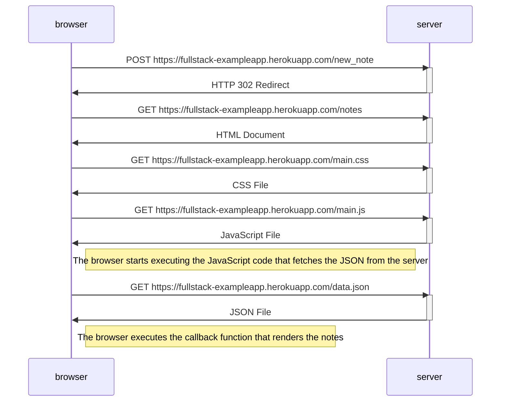

#0.4 - Mermaid Diagram

```mermaid

sequenceDiagram
    participant browser 
    participant server 

    browser->>server: POST https://fullstack-exampleapp.herokuapp.com/new_note
    activate server
    server->>browser: HTTP 302 Redirect 
    deactivate server

    browser->>server: GET https://fullstack-exampleapp.herokuapp.com/notes
    activate server
    server->>browser: HTML Document
    deactivate server

    browser->>server: GET https://fullstack-exampleapp.herokuapp.com/main.css
    activate server
    server->>browser: CSS File
    deactivate server

    browser->>server: GET https://fullstack-exampleapp.herokuapp.com/main.js
    activate server
    server->>browser: JavaScript File
    deactivate server

    Note right of browser : The browser starts executing the JavaScript code that fetches the JSON from the server

    browser->>server: GET https://fullstack-exampleapp.herokuapp.com/data.json
    activate server
    server->>browser: JSON File
    deactivate server

    Note right of browser : The browser executes the callback function that renders the notes
    
```
