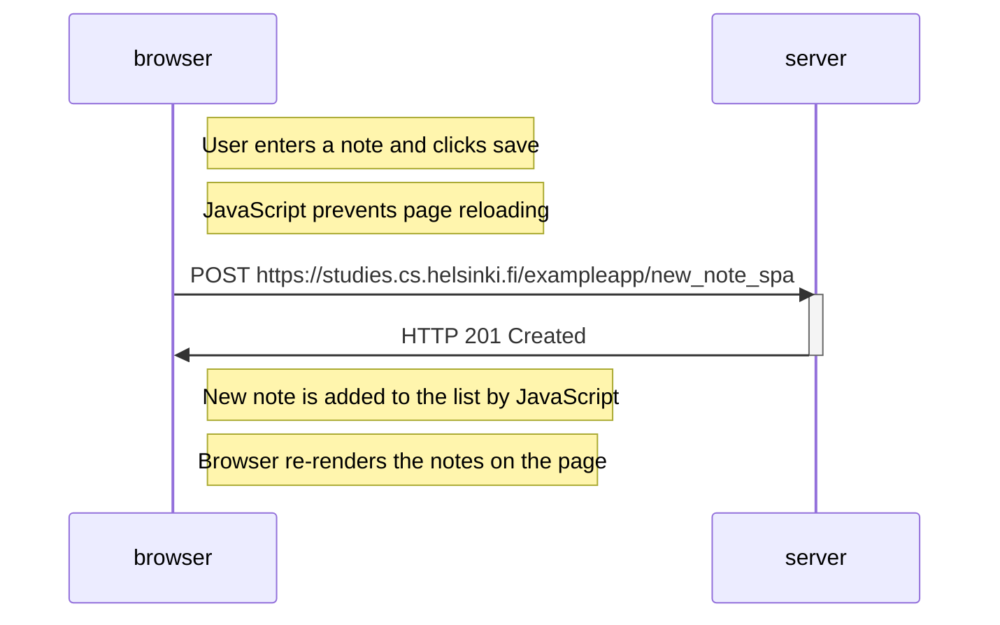

#0.6 Diagram

```mermaid
sequenceDiagram
    participant browser
    participant server
    
    Note right of browser : User enters a note and clicks save 

    Note right of browser : JavaScript prevents page reloading 

    browser->>server: POST https://studies.cs.helsinki.fi/exampleapp/new_note_spa
    activate server
    server->>browser : HTTP 201 Created
    deactivate server

    Note right of browser : New note is added to the list by JavaScript

    Note right of browser : Browser re-renders the notes on the page 
    
```